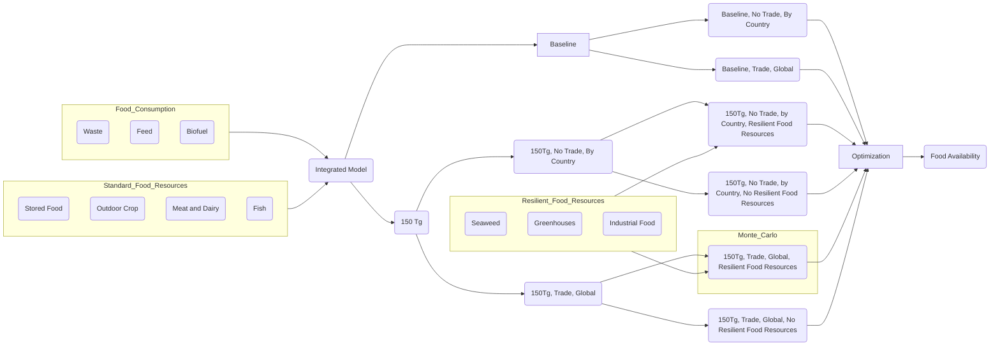

```mermaid
flowchart LR
    subgraph Food_Consumption
    waste(Waste)
    feed(Feed)
    biofuel(Biofuel)
    end

    subgraph Standard_Food_Resources
    stored_food(Stored Food)
    outdoor_crop(Outdoor Crop)
    animal(Meat and Dairy)
    fish(Fish)
    end

    subgraph Resilient_Food_Resources
    seaweed(Seaweed)
    greenhouses(Greenhouses)
    industrial_food(Industrial Food)
    end

    subgraph Monte_Carlo
    trade_150_res_food
    end

    Food_Consumption-->int_model(Integrated Model)
    Standard_Food_Resources-->int_model(Integrated Model)

    int_model(Integrated Model)-->Baseline
    int_model(Integrated Model)-->150Tg(150 Tg)

    Baseline-->no_trade_base(Baseline, No Trade, By Country)
    Baseline-->trade_base(Baseline, Trade, Global)
    150Tg-->no_trade_150(150Tg, No Trade, By Country)
    150Tg-->trade_150(150Tg, Trade, Global)    

    no_trade_150-->no_trade_150_res_food(150Tg, No Trade, by Country, Resilient Food Resources)
    no_trade_150-->no_trade_150_no_res_food(150Tg, No Trade, by Country, No Resilient Food Resources)
    trade_150-->trade_150_res_food(150Tg, Trade, Global, Resilient Food Resources)
    trade_150-->trade_150_no_res_food(150Tg, Trade, Global, No Resilient Food Resources)

    Resilient_Food_Resources-->trade_150_res_food
    Resilient_Food_Resources-->no_trade_150_res_food

    no_trade_base-->Optimization
    trade_base-->Optimization
    no_trade_150_res_food-->Optimization
    no_trade_150_no_res_food-->Optimization
    trade_150_res_food-->Optimization
    trade_150_no_res_food-->Optimization

    Optimization-->FoodAvailability(Food Availability)

```
